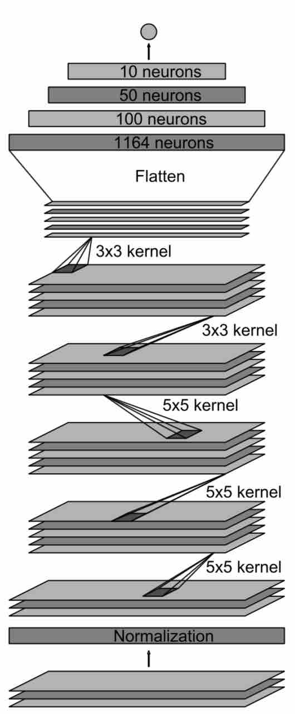

# **Behavioral Cloning** 

## Writeup

---

**Behavioral Cloning Project**

The goals / steps of this project are the following:
* Use the simulator to collect data of good driving behavior
* Build, a convolution neural network in Keras that predicts steering angles from images
* Train and validate the model with a training and validation set
* Test that the model successfully drives around track one without leaving the road
* Summarize the results with a written report

---

## Rubric Points

### Files Submitted & Code Quality

#### 1. Submission includes all required files and can be used to run the simulator in autonomous mode

My project includes the following files:
* model.py containing the script to create and train the model
* drive.py for driving the car in autonomous mode
* model.h5 containing a trained convolution neural network 
* writeup.md summarizing the results

#### 2. Submission includes functional code
Using the Udacity provided simulator and drive.py file, the car can be driven autonomously around the track by executing 
```sh
python drive.py model.h5
```

#### 3. Submission code is usable and readable

The model.py file contains the code for training and saving the convolution neural network. The file shows the pipeline I used for training and validating the model, and it contains comments to explain how the code works.

### Model Architecture and Training Strategy

#### 1. An appropriate model architecture has been employed

My model was based on NVIDIA's "End to End Learning for Self-Driving Cars" paper, consists of 5 convolution neural network and 4 fully-connected layer.

The data was normalized in the model using a Keras lambda layer.

The data was also preprocessed by cropping, gamma random, shear random and so on.

#### 2. Attempts to reduce overfitting in the model

The model was trained and validated on different data sets to ensure that the model was not overfitting. The model was tested by running it through the simulator and ensuring that the vehicle could stay on the track.

#### 3. Model parameter tuning

The model used an adam optimizer, and the learning rate was 1e-4.

#### 4. Appropriate training data

Training data was chosen to keep the vehicle driving on the road. I used a combination of center lane driving, recovering from the left and right sides of the road

Use fit_generator API of the Keras library for training our model.

### Model Architecture and Training Strategy

#### 1. Final Model Architecture

Here is a visualization of the architecture.


#### 2. Creation of the Training Set & Training Process

I used the training data provided by Udacity.

1. Applied random shear on it in order to help the car to navigate in the training track.
2. Applied crop operation on the sheared images in order to remove the extra objects included trees and sky.
3. Applied random flip to avoid excessive left turning.

I used this training data for training the model. The validation set helped determine if the model was over or under fitting.

- The number of epochs was 5.
- The number of samples per epoch was 20032
- The number of validation samples was 6400